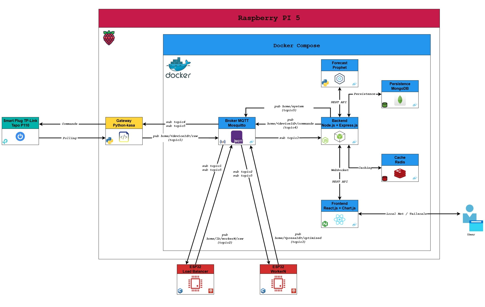

# IoT Home Energy Monitor

Sistema IoT domestico per il monitoraggio e l'ottimizzazione dei consumi energetici, basato su Raspberry Pi 5.

*Tesi di laurea triennale - Ingegneria Informatica.*


## Italiano

### Descrizione

Il sistema monitora in tempo reale i consumi energetici domestici tramite prese smart, ottimizza il volume dei dati raccolti tramite un layer di elaborazione dedicato (ESP32), li rende disponibili tramite una web app (dati, grafici, controllo remoto) e fornisce previsioni sui consumi futuri e suggerimenti di risparmio tramite un modulo di intelligenza artificiale basato su Prophet.

### Stack tecnologico

- **Backend**: Node.js, Express 5, Mongoose (MongoDB), client Redis, Socket.IO, MQTT.js, JWT (`jsonwebtoken`), `bcryptjs`
- **Frontend**: React 19, Vite, React Router, Chart.js, client Socket.IO, nginx (servito in produzione)
- **Gateway**: Python 3.13, `python-kasa`, `paho-mqtt`
- **Previsione**: Python 3.11, Prophet, scikit-learn (rilevamento anomalie)
- **Firmware**: C++ (Arduino/ESP32), `PubSubClient`, `ArduinoJson`
- **Broker messaggi**: Eclipse Mosquitto 2 (MQTT)
- **Persistenza**: MongoDB 7, Redis 7
- **Containerizzazione**: Docker + Docker Compose
- **Avvio di sistema**: systemd (Linux)
- **Accesso remoto**: Tailscale (VPN WireGuard)

### Requisiti hardware

- Raspberry Pi 5, 8 GB RAM, scheda SD
- Hard disk esterno WD Elements 1TB, formattato ext4, usato per la persistenza dei dati (MongoDB, Redis) al posto della scheda SD, per evitarne l'usura
- 2× presa smart TP-Link Tapo P110
- 3× ESP32 (1 come load balancer, 2 come elaboratori)

### Indirizzi IP statici

Il Raspberry Pi e le due prese Tapo hanno un indirizzo IP fisso, riservato dal **pannello di amministrazione del router di casa** (static lease DHCP), non configurato localmente sui singoli dispositivi:

| Dispositivo | IP |
|---|---|
| Raspberry Pi 5 | `192.168.1.178` |
| Presa Tapo P110 - presa1 | `192.168.1.180` |
| Presa Tapo P110 - presa2 | `192.168.1.181` |

Questi indirizzi sono quelli effettivamente usati in `gateway/config/devices.json`, in `esp32/*/secrets.h` (come `MQTT_BROKER`) e nei payload dei comandi (`{"action":"off","ip":"192.168.1.180"}`).

### Architettura in breve

Tutti i servizi principali (broker MQTT, backend, frontend, MongoDB, Redis) girano in container Docker sul Raspberry Pi. Gli ESP32 sono nodi hardware esterni, collegati via WiFi/MQTT.

```
Prese Tapo P110 → Gateway (Python) → Broker MQTT (Mosquitto)
                                            │
                                   ESP32 Load Balancer
                                       │           │
                                  Worker 1     Worker 2
                                            │
                                      Broker MQTT
                                            │
                              Backend (Node/Express)
                        MongoDB · Redis · JWT · Logging
                                            │
                             REST API / WebSocket
                                            │
                              Frontend (React)
```

**Il gateway Python è l'unico servizio dell'architettura a girare fuori Docker**, nativamente sull'host del Raspberry Pi. La scelta è motivata dal fatto che il gateway deve comunicare direttamente con le prese Tapo sulla rete locale (individuazione e comunicazione tramite `python-kasa`, che si aspetta di operare sulla stessa rete IP dei dispositivi): containerizzarlo avrebbe richiesto una rete Docker in modalità host per garantire la stessa visibilità sulla LAN, una complessità aggiuntiva non giustificata per un singolo servizio Python senza altre dipendenze di containerizzazione. Il gateway raggiunge comunque il broker MQTT (che gira in Docker) tramite `localhost`, sfruttando il port mapping esposto dal container Mosquitto, non tramite il nome del servizio Compose `mosquitto`, che sarebbe risolvibile solo dall'interno della rete Docker.

**Prophet non compare nel diagramma sopra** perché non è un servizio sempre acceso come gli altri: è un **batch job giornaliero**, containerizzato ma con profilo Compose `jobs` (non parte con `docker compose up -d` di default), avviato da un timer systemd dedicato con il proprio ciclo di vita, indipendente dal resto del sistema. Ad ogni esecuzione legge lo storico dei consumi e scrive le previsioni tramite una chiamata REST al backend (`BACKEND_URL`), poi termina. Se lo stack Docker è stato fermato a mano, il job semplicemente fallisce (segnalato con `POST /api/logs`) e il timer riprova il giorno successivo, senza impattare il resto del sistema:

```
Prophet (batch giornaliero, timer systemd)
        │  legge storico / scrive previsioni (REST, BACKEND_URL)
        ▼
Backend (Node/Express)
```

Dettagli in [`prophet/README.md`](prophet/README.md) e [`systemd/README.md`](systemd/README.md).

**Segmentazione di rete Docker**: lo stack usa due reti dedicate invece di un'unica rete di default: `backend-net` (broker MQTT, MongoDB, Redis, Prophet, e il backend) e `frontend-net` (frontend e backend). Il backend è l'unico servizio su entrambe le reti, e quindi l'unico punto di contatto tra le due: il frontend non può raggiungere direttamente i servizi dati. Un servizio aggiunto in futuro senza `networks:` esplicito nel `docker-compose.yml` resta isolato per default, invece di ereditare automaticamente l'accesso a tutto lo stack.

### Flusso dati e topic MQTT

Il broker MQTT è il punto di scambio tra tutti i componenti. Tabella completa dei topic usati nel sistema:

| Topic | Publisher | Subscriber | Payload (esempio) | Descrizione |
|---|---|---|---|---|
| `home/<deviceId>/raw` | Gateway | Load balancer (sottoscrive `home/+/raw`) | `{"deviceId":"presa1","timestamp":1784454193.22,"power":12.4,"voltage":230.1,"current":0.054}` | Lettura grezza di potenza/tensione/corrente, pubblicata dal gateway ogni `POLLING_INTERVAL` secondi |
| `home/lb/worker1/raw` | Load balancer | Worker 1 | stesso payload di `raw` | Instradamento del dato grezzo verso il worker assegnato al dispositivo (parità dell'hash calcolato sul topic di arrivo) |
| `home/lb/worker2/raw` | Load balancer | Worker 2 | stesso payload di `raw` | Come sopra, per i dispositivi instradati sull'altro worker |
| `home/<presa_id>/optimized` | Worker 1 / Worker 2 | Backend | `{"presa_id":"presa1","power_w":12.6,"voltage_v":230.0,"current_a":0.055,"sample_count":6,"timestamp_start":...,"timestamp_end":...}` | Dato ottimizzato (raggruppamento di letture simili, scarto di rumore/errori isolati), pronto per la persistenza |
| `home/<deviceId>/commands` | Backend | Gateway | `{"action":"off","ip":"192.168.1.180"}` | Comando on/off inoltrato dal frontend ed eseguito dal gateway sulla presa fisica |
| `home/system/healthcheck` | Backend (admin) | Gateway, Load balancer, Worker 1, Worker 2 | `{}` | Richiesta di stato, in broadcast a tutti i componenti |
| `home/system/healthcheck/response` | Gateway, Load balancer, Worker 1, Worker 2 | Backend | `{"componente":"gateway","stato":"ok"}` | Risposta individuale di ciascun componente alla richiesta di healthcheck |
| `home/system/flush` | Backend (admin) | Worker 1, Worker 2 | `{}` | Richiesta di svuotamento della coda di ritentativo dei messaggi `optimized` pendenti (solo i worker, non gateway/load balancer) |

Il flusso "dati" procede in un verso (presa → gateway → load balancer → worker → backend → frontend); il flusso "controllo" nel verso opposto (frontend/backend → gateway/ESP32), tramite i topic `commands`, `healthcheck` e `flush`.

### Struttura del repository

| Directory | Descrizione | README |
|---|---|---|
| `backend/` | API REST + WebSocket, persistenza, autenticazione, logging | [backend/README.md](backend/README.md) |
| `frontend/` | Web app React (dashboard, grafici, controllo prese) | [frontend/README.md](frontend/README.md) |
| `gateway/` | Servizio Python di lettura/controllo delle prese Tapo | [gateway/README.md](gateway/README.md) |
| `prophet/` | Previsione dei consumi (Prophet), batch job schedulato | [prophet/README.md](prophet/README.md) |
| `mosquitto/` | Configurazione del broker MQTT | [mosquitto/README.md](mosquitto/README.md) |
| `esp32/` | Firmware C++ per load balancer e worker ESP32 | [esp32/README.md](esp32/README.md) |
| `systemd/` | Unit systemd per l'avvio automatico del sistema | [systemd/README.md](systemd/README.md) |

File nella root: `docker-compose.yml` (orchestrazione dei servizi containerizzati), `manage.sh` (script di avvio/arresto), `backup-mongo.sh` (backup schedulato di MongoDB, vedi "Backup" sotto), `.env.example` (template delle variabili lette da Compose).

### Setup completo del sistema

#### 1. Prerequisiti

- Raspberry Pi 5 con Raspberry Pi OS (64-bit), hard disk esterno collegato
- Docker Engine + plugin Docker Compose v2 (il `docker-compose.yml` non ha `version:` in testa, richiede lo schema moderno del plugin)
- Python 3.13 sull'host (per il gateway)
- Node.js ≥ 20 (solo per eseguire backend/frontend fuori Docker in sviluppo)
- Arduino IDE 2.x (solo per programmare gli ESP32, non necessario in esecuzione)

#### 2. Preparazione dell'hard disk esterno

```bash
# Verificare sempre il device corretto con lsblk/fdisk prima di procedere: operazione distruttiva
sudo wipefs -a /dev/sda
sudo parted /dev/sda --script mklabel gpt
sudo parted /dev/sda --script mkpart primary ext4 0% 100%
sudo mkfs.ext4 -L wd1tb /dev/sda1
sudo mkdir -p /mnt/wd1tb && sudo mount /dev/sda1 /mnt/wd1tb
# Aggiungere una voce in /etc/fstab:
# UUID=<uuid> /mnt/wd1tb ext4 defaults,noatime,nofail 0 2

sudo mkdir -p /mnt/wd1tb/iot-energy/mongodb /mnt/wd1tb/iot-energy/redis
sudo chown -R 999:999 /mnt/wd1tb/iot-energy/mongodb
sudo chown -R 999:999 /mnt/wd1tb/iot-energy/redis
```

#### 3. Variabili d'ambiente: tre file `.env` distinti

Il sistema usa **tre file `.env` separati**, con scopi diversi. `MQTT_USER`/`MQTT_PASSWORD` devono avere lo **stesso valore in tutti e tre**.

| File | Letto da | Obbligatorio |
|---|---|---|
| `.env` (root) | `docker-compose.yml`, interpolazione `${...}` | Sì, senza i container non ricevono le credenziali |
| `backend/.env` | `npm run dev` in locale, fuori Docker | No, il container backend non lo legge |
| `gateway/config/.env` | Script Python del gateway | Sì, sempre: unica fonte di credenziali del gateway (mai containerizzato) |

Copiare il rispettivo `.env.example` in `.env` in ciascuna posizione e compilare i valori. Generazione dei segreti:

```bash
# JWT_SECRET
node -e "console.log(require('crypto').randomBytes(64).toString('hex'))"

# ADMIN_PASSWORD_HASH
node -e "require('bcryptjs').hash(process.argv[1], 10).then(console.log)" 'la-tua-password'
```

Dettaglio delle singole variabili nei README di [`backend/`](backend/README.md) e [`gateway/`](gateway/README.md).

#### 4. Credenziali del broker MQTT (una tantum, o al cambio password)

```bash
mosquitto_passwd -c mosquitto/config/passwordfile <utente>
sudo chown 1883:1883 mosquitto/config/passwordfile
sudo chmod 0700 mosquitto/config/passwordfile
sudo chown -R 1883:1883 mosquitto/data mosquitto/log
```

Impostare le variabili d'ambiente Docker (già fatto nel compose) **non crea da sola** l'utente sul broker: servono entrambi i passaggi.

#### 5. Configurazione degli ESP32

Per ciascuna delle tre cartelle in `esp32/` (`load_balancer/`, `worker1/`, `worker2/`), copiare `secrets.h.example` in `secrets.h` e compilare con SSID/password WiFi, l'IP del Raspberry (`192.168.1.178`) e le stesse credenziali MQTT usate sopra. Flashare da Arduino IDE: dettagli in [`esp32/README.md`](esp32/README.md).

#### 6. Avvio dello stack Docker

```bash
cd ~/iot   # root del repo clonato
docker compose up -d --build
docker compose ps   # verificare che tutti i servizi risultino "healthy"
```

#### 7. Avvio del gateway (fuori Docker)

```bash
cd gateway
python3 -m venv venv
source venv/bin/activate
pip install -r requirements.txt
cp config/.env.example config/.env   # e compilare i valori
python src/main.py
```

#### 8. Installazione come servizio systemd (produzione)

```bash
sudo cp systemd/iot-energy-docker.service systemd/iot-energy-gateway.service /etc/systemd/system/
sudo systemctl daemon-reload
sudo systemctl enable --now iot-energy-docker.service iot-energy-gateway.service
```

Gestione tramite lo script wrapper:

```bash
./manage.sh start     # avvia lo stack Docker, poi il gateway
./manage.sh stop      # arresta il gateway, poi lo stack Docker (arresto "soft")
./manage.sh status
```

#### 9. Installazione del job Prophet (previsioni)

A differenza degli altri componenti, Prophet non fa parte dello stack avviato al punto 6: richiede un passaggio di integrazione nel `docker-compose.yml` e l'installazione di una unit systemd separata.

```bash
cd prophet
cp config/.env.example config/.env   # e compilare BACKEND_URL
```

Unire manualmente il blocco del servizio `prophet` sotto `services:` nel `docker-compose.yml` di root (dettagli e blocco completo in [`prophet/README.md`](prophet/README.md)), poi installare il timer:

```bash
sudo cp systemd/iot-prophet-forecast.service systemd/iot-prophet-forecast.timer /etc/systemd/system/
sudo systemd-analyze verify iot-prophet-forecast.service iot-prophet-forecast.timer
sudo systemctl daemon-reload
sudo systemctl enable --now iot-prophet-forecast.timer
```

Dettagli completi (formato di `config/interruzioni.yaml`, test manuale del job, motivazione delle scelte sulla unit) in [`prophet/README.md`](prophet/README.md) e [`systemd/README.md`](systemd/README.md).

#### 10. Installazione del backup MongoDB schedulato

```bash
sudo cp systemd/iot-mongo-backup.service systemd/iot-mongo-backup.timer /etc/systemd/system/
sudo systemctl daemon-reload
sudo systemctl enable --now iot-mongo-backup.timer
```

Dettagli in [`systemd/README.md`](systemd/README.md) e nella sezione "Backup" sotto.

### Testing

Suite di test automatizzata su backend (Jest, 101 test), frontend (Vitest, 95 test) e prophet (pytest, 92 test): 288 test in totale sui tre componenti coperti. Gateway e firmware ESP32 restano verificati solo manualmente (`mosquitto_pub`/`sub`, CLI `kasa`, Serial Monitor). Dettagli nei README di [`backend/`](backend/README.md), [`frontend/`](frontend/README.md) e [`prophet/`](prophet/README.md). Per backend e frontend, la tabella di dettaglio per singolo file riflette la suite al momento della sua introduzione (62/48 test); i totali qui sopra sono quelli aggiornati.

Le immagini Docker di backend e frontend includono anche uno stage `test` nella build stessa (`build` → `test` → `production`): `docker compose build` (o `up --build`) esegue la suite come parte della build e si interrompe prima di produrre l'immagine di produzione se i test falliscono.

### Backup

Dump completo e giornaliero di MongoDB (`mongodump --archive --gzip`, script `backup-mongo.sh` in root) verso `/mnt/wd1tb/iot-energy/backups/mongodb/`, con rotazione automatica (elimina i dump più vecchi di `RETENTION_DAYS`, default 7 giorni). Non è un backup incrementale: richiederebbe l'oplog di un replica set, non presente in questo deployment standalone. È invece una serie progressiva di dump completi datati, ciascuno autonomamente ripristinabile.

Schedulato alle 03:00 tramite `iot-mongo-backup.timer` (systemd), orario scelto per non competere per I/O con `iot-prophet-forecast.timer`, che gira alle 00:05. Dettagli sulla unit in [`systemd/README.md`](systemd/README.md).

**Redis non è incluso nel backup**: per come è usato nel progetto (cache degli N valori più recenti, non fonte di verità) è ricostruibile da MongoDB, non serve persisterne una copia.

Verifica/test manuale:
```bash
sudo systemctl start iot-mongo-backup.service
sudo journalctl -u iot-mongo-backup.service -n 20
ls -lh /mnt/wd1tb/iot-energy/backups/mongodb/
```

Restore, se necessario:
```bash
docker compose exec -T mongodb mongorestore \
  --username admin --password '<MONGO_ROOT_PASSWORD>' \
  --authenticationDatabase admin \
  --drop --gzip --archive < /mnt/wd1tb/iot-energy/backups/mongodb/iot_energy-<timestamp>.archive.gz
```
`--drop` sostituisce le collection esistenti: va lanciato con attenzione, non per errore su dati che non si vogliono perdere.

**Limitazione nota**: la copia resta sullo stesso hard disk dei dati live. Protegge da errori applicativi o restore sbagliati, non da un guasto fisico del disco. Nessuna copia off-site configurata.

### Limitazioni note

- Comunicazione MQTT degli ESP32 con QoS 0 reale (limite della libreria `PubSubClient`), compensato lato firmware con una coda di ritentativo solo in RAM: non sopravvive a una perdita di alimentazione della scheda.
- Load balancer statico su 2 worker fissi, nessuna registrazione dinamica di nuovi elaboratori.
- Backend esposto su HTTP semplice (non HTTPS): scelta motivata dal fatto che il traffico remoto passa comunque da Tailscale, cifrato a livello WireGuard.
- Singolo utente amministratore con credenziali fisse in `.env`, nessuna gestione multi-utente.
- Backup di MongoDB solo locale (stesso hard disk dei dati live), nessuna copia off-site.

---

## English

### Description

The system monitors household energy consumption in real time through smart plugs, reduces the volume of collected data through a dedicated processing layer (ESP32), exposes it through a web app (data, charts, remote control), and provides consumption forecasts and saving suggestions through an AI module based on Prophet.

### Tech stack

- **Backend**: Node.js, Express 5, Mongoose (MongoDB), Redis client, Socket.IO, MQTT.js, JWT (`jsonwebtoken`), `bcryptjs`
- **Frontend**: React 19, Vite, React Router, Chart.js, Socket.IO client, nginx (serving in production)
- **Gateway**: Python 3.13, `python-kasa`, `paho-mqtt`
- **Forecasting**: Python 3.11, Prophet, scikit-learn (anomaly detection)
- **Firmware**: C++ (Arduino/ESP32), `PubSubClient`, `ArduinoJson`
- **Message broker**: Eclipse Mosquitto 2 (MQTT)
- **Persistence**: MongoDB 7, Redis 7
- **Containerization**: Docker + Docker Compose
- **System startup**: systemd (Linux)
- **Remote access**: Tailscale (WireGuard VPN)

### Hardware requirements

- Raspberry Pi 5, 8 GB RAM, SD card
- WD Elements 1TB external hard disk, formatted ext4, used for data persistence (MongoDB, Redis) instead of the SD card, to avoid wear
- 2× TP-Link Tapo P110 smart plug
- 3× ESP32 (1 as load balancer, 2 as processors)

### Static IP addresses

The Raspberry Pi and the two Tapo plugs have a fixed IP address, reserved from the **home router's admin panel** (DHCP static lease), not configured locally on each device:

| Device | IP |
|---|---|
| Raspberry Pi 5 | `192.168.1.178` |
| Tapo P110 plug - presa1 | `192.168.1.180` |
| Tapo P110 plug - presa2 | `192.168.1.181` |

These are the addresses actually used in `gateway/config/devices.json`, in `esp32/*/secrets.h` (as `MQTT_BROKER`), and in command payloads (`{"action":"off","ip":"192.168.1.180"}`).

### Architecture at a glance

All main services (MQTT broker, backend, frontend, MongoDB, Redis) run in Docker containers on the Raspberry Pi. The ESP32 boards are external hardware nodes, connected via WiFi/MQTT.

```
Tapo P110 plugs → Gateway (Python) → MQTT Broker (Mosquitto)
                                            │
                                    ESP32 Load Balancer
                                       │           │
                                  Worker 1     Worker 2
                                            │
                                       MQTT Broker
                                            │
                              Backend (Node/Express)
                        MongoDB · Redis · JWT · Logging
                                            │
                             REST API / WebSocket
                                            │
                              Frontend (React)
```

**The Python gateway is the only service in the architecture running outside Docker**, natively on the Raspberry Pi host. This choice is motivated by the fact that the gateway needs to communicate directly with the Tapo plugs on the local network (discovery and communication via `python-kasa`, which expects to operate on the same IP network as the devices): containerizing it would have required Docker host networking to guarantee the same LAN visibility, added complexity not justified for a single Python service with no other containerization dependencies. The gateway still reaches the MQTT broker (which runs in Docker) via `localhost`, relying on the port mapping exposed by the Mosquitto container, not via the Compose service name `mosquitto`, which would only be resolvable from inside the Docker network.

**Prophet does not appear in the diagram above** because it isn't an always-on service like the others: it's a **daily batch job**, containerized but under the Compose `jobs` profile (it does not start with `docker compose up -d` by default), triggered by a dedicated systemd timer with its own lifecycle, independent from the rest of the system. On each run it reads the consumption history and writes the forecasts through a REST call to the backend (`BACKEND_URL`), then exits. If the Docker stack was stopped by hand, the job simply fails (reported via `POST /api/logs`) and the timer retries the next day, without impacting the rest of the system:

```
Prophet (daily batch job, systemd timer)
        │  reads history / writes forecasts (REST, BACKEND_URL)
        ▼
Backend (Node/Express)
```

Details in [`prophet/README.md`](prophet/README.md) and [`systemd/README.md`](systemd/README.md).

**Docker network segmentation**: the stack uses two dedicated networks instead of a single default one: `backend-net` (MQTT broker, MongoDB, Redis, Prophet, and the backend) and `frontend-net` (frontend and backend). The backend is the only service on both networks, and therefore the only point of contact between the two: the frontend cannot reach the data services directly. A service added in the future without an explicit `networks:` entry in `docker-compose.yml` stays isolated by default, instead of automatically inheriting access to the whole stack.

### Data flow and MQTT topics

The MQTT broker is the exchange point between all components. Full table of the topics used in the system:

| Topic | Publisher | Subscriber | Payload (example) | Description |
|---|---|---|---|---|
| `home/<deviceId>/raw` | Gateway | Load balancer (subscribes to `home/+/raw`) | `{"deviceId":"presa1","timestamp":1784454193.22,"power":12.4,"voltage":230.1,"current":0.054}` | Raw power/voltage/current reading, published by the gateway every `POLLING_INTERVAL` seconds |
| `home/lb/worker1/raw` | Load balancer | Worker 1 | same payload as `raw` | Routes the raw reading to the worker assigned to the device (parity of a hash computed on the incoming topic) |
| `home/lb/worker2/raw` | Load balancer | Worker 2 | same payload as `raw` | Same as above, for devices routed to the other worker |
| `home/<presa_id>/optimized` | Worker 1 / Worker 2 | Backend | `{"presa_id":"presa1","power_w":12.6,"voltage_v":230.0,"current_a":0.055,"sample_count":6,"timestamp_start":...,"timestamp_end":...}` | Optimized reading (grouping of similar readings, discarding isolated noise/errors), ready for persistence |
| `home/<deviceId>/commands` | Backend | Gateway | `{"action":"off","ip":"192.168.1.180"}` | On/off command forwarded by the frontend and executed by the gateway on the physical plug |
| `home/system/healthcheck` | Backend (admin) | Gateway, Load balancer, Worker 1, Worker 2 | `{}` | Status request, broadcast to all components |
| `home/system/healthcheck/response` | Gateway, Load balancer, Worker 1, Worker 2 | Backend | `{"componente":"gateway","stato":"ok"}` | Individual response from each component to the healthcheck request |
| `home/system/flush` | Backend (admin) | Worker 1, Worker 2 | `{}` | Request to empty the retry queue of pending `optimized` messages (workers only, not gateway/load balancer) |

The "data" flow moves in one direction (plug → gateway → load balancer → worker → backend → frontend); the "control" flow moves in the opposite direction (frontend/backend → gateway/ESP32), through the `commands`, `healthcheck`, and `flush` topics.

### Repository structure

| Directory | Description | README |
|---|---|---|
| `backend/` | REST + WebSocket API, persistence, authentication, logging | [backend/README.md](backend/README.md) |
| `frontend/` | React web app (dashboard, charts, plug control) | [frontend/README.md](frontend/README.md) |
| `gateway/` | Python service for reading/controlling the Tapo plugs | [gateway/README.md](gateway/README.md) |
| `prophet/` | Consumption forecasting (Prophet), scheduled batch job | [prophet/README.md](prophet/README.md) |
| `mosquitto/` | MQTT broker configuration | [mosquitto/README.md](mosquitto/README.md) |
| `esp32/` | C++ firmware for the load balancer and worker ESP32 boards | [esp32/README.md](esp32/README.md) |
| `systemd/` | systemd units for automatic system startup | [systemd/README.md](systemd/README.md) |

Files in the root: `docker-compose.yml` (orchestration of the containerized services), `manage.sh` (start/stop wrapper script), `backup-mongo.sh` (scheduled MongoDB backup, see "Backup" below), `.env.example` (template of the variables read by Compose).

### Full system setup

#### 1. Prerequisites

- Raspberry Pi 5 running Raspberry Pi OS (64-bit), external hard disk attached
- Docker Engine + Docker Compose v2 plugin (`docker-compose.yml` has no top-level `version:`, requires the modern plugin schema)
- Python 3.13 on the host (for the gateway)
- Node.js ≥ 20 (only needed to run backend/frontend outside Docker for development)
- Arduino IDE 2.x (only needed to flash the ESP32 boards, not required at runtime)

#### 2. External hard disk setup

```bash
# Always verify the correct device with lsblk/fdisk before proceeding: this is destructive
sudo wipefs -a /dev/sda
sudo parted /dev/sda --script mklabel gpt
sudo parted /dev/sda --script mkpart primary ext4 0% 100%
sudo mkfs.ext4 -L wd1tb /dev/sda1
sudo mkdir -p /mnt/wd1tb && sudo mount /dev/sda1 /mnt/wd1tb
# Add an entry to /etc/fstab:
# UUID=<uuid> /mnt/wd1tb ext4 defaults,noatime,nofail 0 2

sudo mkdir -p /mnt/wd1tb/iot-energy/mongodb /mnt/wd1tb/iot-energy/redis
sudo chown -R 999:999 /mnt/wd1tb/iot-energy/mongodb
sudo chown -R 999:999 /mnt/wd1tb/iot-energy/redis
```

#### 3. Environment variables: three separate `.env` files

The system uses **three separate `.env` files**, each with a different purpose. `MQTT_USER`/`MQTT_PASSWORD` must have the **same value in all three**.

| File | Read by | Required |
|---|---|---|
| `.env` (root) | `docker-compose.yml`, `${...}` interpolation | Yes, without it containers receive no credentials |
| `backend/.env` | `npm run dev` locally, outside Docker | No, the backend container never reads it |
| `gateway/config/.env` | Gateway Python scripts | Yes, always: the gateway's only source of credentials (never containerized) |

Copy the corresponding `.env.example` to `.env` in each location and fill in the values. Secret generation:

```bash
# JWT_SECRET
node -e "console.log(require('crypto').randomBytes(64).toString('hex'))"

# ADMIN_PASSWORD_HASH
node -e "require('bcryptjs').hash(process.argv[1], 10).then(console.log)" 'your-password'
```

Per-variable details in the [`backend/`](backend/README.md) and [`gateway/`](gateway/README.md) READMEs.

#### 4. MQTT broker credentials (one-time, or when the password changes)

```bash
mosquitto_passwd -c mosquitto/config/passwordfile <username>
sudo chown 1883:1883 mosquitto/config/passwordfile
sudo chmod 0700 mosquitto/config/passwordfile
sudo chown -R 1883:1883 mosquitto/data mosquitto/log
```

Setting the Docker environment variables (already done in the compose file) does **not** create the broker user by itself: both steps are required.

#### 5. ESP32 configuration

For each of the three folders under `esp32/` (`load_balancer/`, `worker1/`, `worker2/`), copy `secrets.h.example` to `secrets.h` and fill in the WiFi SSID/password, the Raspberry Pi's IP (`192.168.1.178`), and the same MQTT credentials used above. Flash from Arduino IDE: details in [`esp32/README.md`](esp32/README.md).

#### 6. Starting the Docker stack

```bash
cd ~/iot   # cloned repo root
docker compose up -d --build
docker compose ps   # verify all services report "healthy"
```

#### 7. Starting the gateway (outside Docker)

```bash
cd gateway
python3 -m venv venv
source venv/bin/activate
pip install -r requirements.txt
cp config/.env.example config/.env   # and fill in the values
python src/main.py
```

#### 8. Installing as a systemd service (production)

```bash
sudo cp systemd/iot-energy-docker.service systemd/iot-energy-gateway.service /etc/systemd/system/
sudo systemctl daemon-reload
sudo systemctl enable --now iot-energy-docker.service iot-energy-gateway.service
```

Managed through the wrapper script:

```bash
./manage.sh start     # starts the Docker stack, then the gateway
./manage.sh stop      # stops the gateway, then the Docker stack (soft shutdown)
./manage.sh status
```

#### 9. Installing the Prophet job (forecasting)

Unlike the other components, Prophet is not part of the stack started in step 6: it requires an integration step in `docker-compose.yml` and the installation of a separate systemd unit.

```bash
cd prophet
cp config/.env.example config/.env   # and fill in BACKEND_URL
```

Merge the `prophet` service block manually under `services:` in the root `docker-compose.yml` (full block and details in [`prophet/README.md`](prophet/README.md)), then install the timer:

```bash
sudo cp systemd/iot-prophet-forecast.service systemd/iot-prophet-forecast.timer /etc/systemd/system/
sudo systemd-analyze verify iot-prophet-forecast.service iot-prophet-forecast.timer
sudo systemctl daemon-reload
sudo systemctl enable --now iot-prophet-forecast.timer
```

Full details (the `config/interruzioni.yaml` format, manually testing the job, the reasoning behind the unit's settings) in [`prophet/README.md`](prophet/README.md) and [`systemd/README.md`](systemd/README.md).

#### 10. Installing the scheduled MongoDB backup

```bash
sudo cp systemd/iot-mongo-backup.service systemd/iot-mongo-backup.timer /etc/systemd/system/
sudo systemctl daemon-reload
sudo systemctl enable --now iot-mongo-backup.timer
```

Details in [`systemd/README.md`](systemd/README.md) and in the "Backup" section below.

### Testing

Automated test suite on the backend (Jest, 101 tests), frontend (Vitest, 95 tests), and prophet (pytest, 92 tests): 288 tests in total across the three components covered. The gateway and ESP32 firmware are still only verified manually (`mosquitto_pub`/`sub`, the `kasa` CLI, Serial Monitor). Details in the [`backend/`](backend/README.md), [`frontend/`](frontend/README.md), and [`prophet/`](prophet/README.md) READMEs. For backend and frontend, the per-file breakdown table reflects the suite as it was introduced (62/48 tests); the totals above are the updated ones.

The backend and frontend Docker images also include a `test` stage in the build itself (`build` → `test` → `production`): `docker compose build` (or `up --build`) runs the suite as part of the build and stops before producing the production image if the tests fail.

### Backup

A full, daily MongoDB dump (`mongodump --archive --gzip`, `backup-mongo.sh` script in the root) to `/mnt/wd1tb/iot-energy/backups/mongodb/`, with automatic rotation (deletes dumps older than `RETENTION_DAYS`, default 7 days). This is not an incremental backup: that would require the oplog of a replica set, not present in this standalone deployment. It's instead a progressive series of dated full dumps, each independently restorable.

Scheduled at 03:00 via `iot-mongo-backup.timer` (systemd), a time chosen to avoid competing for I/O with `iot-prophet-forecast.timer`, which runs at 00:05. Unit details in [`systemd/README.md`](systemd/README.md).

**Redis is not included in the backup**: given how it's used in the project (a cache of the most recent N values, not a source of truth), it can be rebuilt from MongoDB, so persisting a copy of it isn't needed.

Manual verification/test:
```bash
sudo systemctl start iot-mongo-backup.service
sudo journalctl -u iot-mongo-backup.service -n 20
ls -lh /mnt/wd1tb/iot-energy/backups/mongodb/
```

Restore, if needed:
```bash
docker compose exec -T mongodb mongorestore \
  --username admin --password '<MONGO_ROOT_PASSWORD>' \
  --authenticationDatabase admin \
  --drop --gzip --archive < /mnt/wd1tb/iot-energy/backups/mongodb/iot_energy-<timestamp>.archive.gz
```
`--drop` replaces the existing collections: run it carefully, not by mistake on data you don't want to lose.

**Known limitation**: the copy stays on the same hard disk as the live data. It protects against application errors or bad restores, not against a physical disk failure. No off-site copy is configured.

### Known limitations

- ESP32 MQTT communication uses real QoS 0 (a limitation of the `PubSubClient` library), compensated on the firmware side with a RAM-only retry queue: it does not survive a power loss on the board.
- Static load balancer with 2 fixed workers, no dynamic registration of additional processors.
- The backend is exposed over plain HTTP (not HTTPS): this choice is justified by the fact that remote traffic already goes through Tailscale, encrypted at the WireGuard layer.
- Single administrator account with fixed credentials in `.env`, no multi-user management.
- MongoDB backup is local only (same hard disk as the live data), no off-site copy.